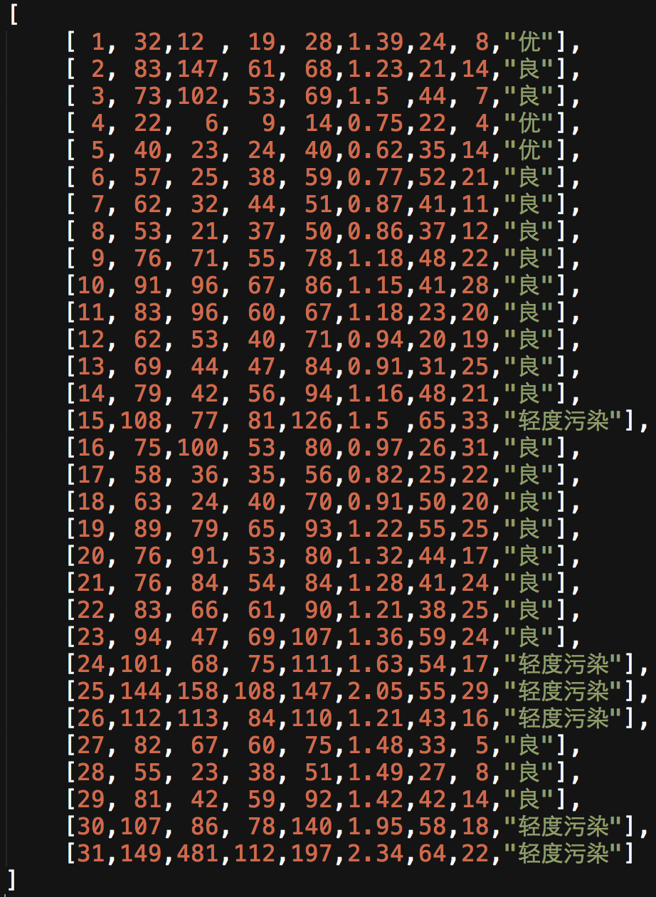
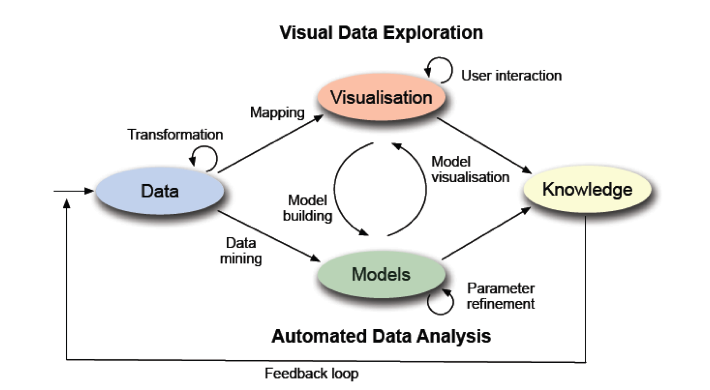
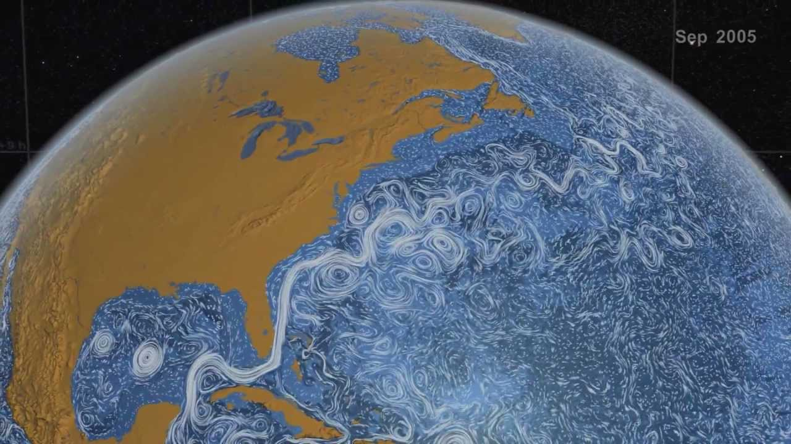

# Echarts Next

### —— 数据 · 视觉编码 · 交互

Echarts团队

Note:
自我介绍

---


Note: 海量数据

----


Note: 如何转化为人脑可认知的视觉元素

----


----


----


Note:
哪个年龄段及收入水平人群的三酸甘油脂水平（身体脂肪量）趋势与其他均不同？

----


----


### {0|视觉感知}

> {0|客观事物通过人的视觉在人脑中形成的直接反映}

### {1|认知}

> {1|信息的获取、分析、归纳、解码、储存、概念形成、提取和使用}

### {2|**擅长**}

Note:
人类擅长使用视觉接收的信息，绝大多数知识也是视觉感知获得的。说明了可视化的重要性。

认知心理学将认知过程看成由信息的获取、分析、归纳、解码、储存、概念形成、提取和使用等一系列阶段组成的按一定程序进行的信息加工系统。

简单说，感知是关于输入信号的本质，也就是看见的事物；而认知是关于怎样理解和解释看到的东西。

接受到的信息大部分来源于视觉。视觉擅长进行认知。

----


Note:

再举个例子，相关系数。
安斯库姆四重奏（Anscombe's quartet）是四组基本的统计特性一致的数据，但由它们绘制出的图则截然不同。每一组数据都包括了11个(x,y)点，
四组数据里 x**均值方差**全相等，y**均值方差**基本相等，x与y的**相关系数**也很接近。导致的结果是，四组数据**线性回归**的结果基本一样。
但是，这四组数据**本身差别很大**。
分析数据前先绘制图表的重要性

----


---


# 数据


----


### 类别

* {0|数值}

    * {0|10米 5mA 2048KB 312天}

* {1|有序}

    * {1|小，中，大}
    * {1|周一，周二，周三}

* {2|类别}

    * {2|北京，南京，开封}

* {3|维度}

    * {3|一维、二维、三维、n维}

* {4|关系}

    * {4|树、图（网络）}


Note:
可视化的设计、ec的制作中，考虑对数据从这些类别上来刻画。
映射、视觉元素


---

# 可视编码

* {0|标记（图形元素）}
* {1|视觉通道}

Note:

可视编码由两部分组成:标记 和 视觉通道（用于控制标记的视觉特征）

可视编码是信息可视化的核心，是将数据信息映射成可视化元素的技术。

----

## 标记

<div style="min-width: 1050px">
<div style="float:left;">
{0|
点
~[350*400](./asset/ec-demo/glyph-point.html)
}
</div>

<div style="float:left;">
{1|
线
~[350*400](./asset/ec-demo/glyph-line.html)
}
</div>

<div style="float:left;">
{2|
面
~[350*400](./asset/ec-demo/glyph-area.html)
}
</div>


Note: 这个大家都知道。

----

## 视觉通道

{0|颜色&nbsp;&nbsp;&nbsp;亮度&nbsp;&nbsp;&nbsp;饱和度&nbsp;&nbsp;&nbsp;透明度&nbsp;&nbsp;&nbsp;色调
}
{1|尺寸&nbsp;&nbsp;&nbsp;形状&nbsp;&nbsp;&nbsp;纹理&nbsp;&nbsp;&nbsp;方向}
{2|动画}


Note:
生物学上，视觉通道指的是“大脑接受外部世界视觉信息的通道”，是“通过眼睛接受外界光线的明暗、色彩、形状等，产生对事物的辨别与记忆能力”

但是在可视化中，可能没有给予足够的意识

1.类型（type）
    是什么/在哪里（what/where）
    何种程度（how much）

其中视觉通道要求：
2.表现力（expressiveness）
    要求通过准确编码，来表达数据的完整属性
    判断标准：精确性、可辨性、可分离性、视觉突出
3.有效性（effectiveness）
    通道表现力符合数据属性的重要性

下面是一些视觉通道的解释

----

### 颜色


{0|类别型数据}

{1|~[800*500](./asset/ec-demo/color-category.html)}

----

#### 颜色 - 数值型数据

{0|~[900*600](./asset/ec-demo/color-grey.html)}


----

#### 颜色 - 多种视觉通道

<div style="text-align: center; width: 1110px;">

<div style="display:inline-block;vertical-align:middle;width: 300px">

更多的维度<br>



</div>


<div style="display:inline-block;vertical-align:middle;width: 800px">


{0|~[1000*500](./asset/ec-demo/color-mix-aqi.html)}

</div>
</div>

Note:
这是一个使用多种视觉通道表示多维数据的例子。
圆的面积表示 PM2.5的浓度，颜色明暗表示SO2的浓度。
通过调整数据选择器，可以直观反应一些问题。

这组数据可以被映射到亮度(Lightness)、饱和度(Saturation)、透明度(Alpha)、形状(symbol)、大小(symbolSize)

----

### 三维 · 高度

{0|~[1280*650](./asset/ec-demo/global-population.html)}


----


### 形状

~[1000*500](./asset/ec-demo/symbol.html)

----


### 视觉突出

~[1000*500](./asset/ec-demo/symbol-categories.html)

Note:
虽然可以把数据映射到形状上，但是效果并不如颜色和大小，
所以把重要的映射到人感知比较敏感的视觉通道上。


这个不讲了

### 色彩设计原则

* 避免过多颜色交错导致的杂乱无章
* 使用中性背景色，控制对全局色彩的影响
* 最小化同时对比


---

# 交互

----

### 反馈回路



Note:
单独拿出来讲一下，是因为以前的数据可视化，大都只是单一的图形展现。
但是这样就减弱了人对数据的作用，减少了数据对人的反馈。

这是个 “可视分析模型” 图。
数据->可视化->通过交互操作，再反馈到数据的变化。 在通过不同的可视化获得最终的知识。
只是以这个为例说明用户参与的反馈回路。
期间，人脑是需要重度参与其中的


----

### 可视化设计原则

<div style="text-align: center">

<div style="display:inline-block;vertical-align:top;width: 500px;">
{0|【任务】}


* {0|总览（overview）}
* {0|缩放（zoom）}
* {0|过滤（filter）}
* {0|按需细节<br>（details-on-demand）}
* {0|相关（relate）}
* {0|历史（history）}
</div>

<div style="display:inline-block;vertical-align:top;width: 400px;">

{1|【可视化箴言】}

* {1|总览为先（Overview first）}
* {1|缩放过滤（zoom and filter）}
* {1|按需查看细节（details on demand）}

</div>

</div>

Note:
可视化交互过程中，一般有一下这些操作：总览、缩放、过滤、查看细节等

----

#### 数据缩放 - 单一维度选择

~[1000*500](./asset/ec-demo/dataZoom-K-line.html)

Note:
现实中比较常见的就是股市的 K线图.

----

#### 数据缩放 - 多维度选择

~[1000*500](./asset/ec-demo/dataZoom-cartesian-hv.html)

Note:
这是一个有3000多条数据的柱状图，通过拖拽数值区域控制器，可以进行局部的数据的显示。
横轴时间，纵轴为下水量。先查看总体趋势，在查看细节信息。

----


## 动画

* {0|带来工程的复杂性}

    * {0|软件脆弱}
    * {0|代码繁杂}

* {1|表达 数据/图形元素在**变化**中的**联系**，助于理解}

Note:

（1）虽然动画带来工程角度的复杂性，使代码更难维护和抽象，增加软件的脆弱（带来bug），增加代码的繁杂（性能优化）。
（2）但是表达交互中数据/图形元素变化的联系，比突变的数据展现更助于理解。

因为我们觉得动画在可视化交互中有比较好的效果，是很重要的一点，因此在动画绘制方面花了一些大的精力去处理。增加了更好的视觉实现。

----

### The Wealth & Health of Nations

~[1200*600](./asset/ec-demo/life-expectancy.html)


Note:
这是在 Gapminder 上一个经典的数据可视化分析工具，将世界各国的各种数据通过气泡图来展现，并且增加了动画效果，便于观察某项数据的变化情况。
横坐标=>人均收入，纵坐标=>人均寿命，气泡颜色=>国家，气泡的大小=>总人口。

原始数据的国家比较多，保留了主要国家演示。

结论：
经过二战以后，各国都快速发展，中国在61-62年期间数据大幅下降——三年灾害
二战后美国迅速崛起、改革开放以后，中国迅速发展、但欧美远超亚洲、挪威遥遥领先、朝鲜垫底

修改各个维度的数据，就可以呈现多种结论。非常有意思


---


# 各种数据的可视化


Note:
以上数据可视化过程中的基本概念就介绍结束了。接下来看下实际可视化场景中的例子。

----

### 点数据的可视化


{0|~[1000*500](./asset/ec-demo/map-weibo.html)}

Note:
点数据 ——
描述地理空间中离散的点，具有经度和纬度的坐标，但不具备大小和尺寸，
包括地图上的地标、附件的美食等

最直接的可视化点数据的方法
根据坐标直接标识在地图上，圆点是最常用的标识符号，其他标识符号还有向量箭头


weibo签到：11.8w 数据

----

### 线数据的可视化 - 2D
{0|~[1200*600](./asset/ec-demo/migration.html)}

Note:
2015年百度迁徙的数据，地图上的线表示的人口迁徙的方向

----


### 线数据的可视化 - 3D

{0|~[1200*600](./asset/ec-demo/global-airline.html)}

Note:
线数据通常指连接两个或多个地点的线段或路径，线数据具有长度属性，即经过的地理距离
可以揽到美国机场更多集中在东西岸


----

### 场 · 向量

<div style="width: 600px; float:left">
{0|}
</div>
<div style="width: 350px; float:left">
{1|}
</div>

Note:

NASA Perpetual Ocean

----

~[1200*650](./asset/ec-demo/global-wave.html)

Note: 洋流信息 05年 NASA 给出的一份洋流数据

----


### 时间数据的可视化


{0|~[1000*500](./asset/ec-demo/dataZoom-cartesian-hv.html)}

Note:
横轴是时间。

----

~[1000*500](./asset/ec-demo/timeline-ecnomic.html)

Note:
时间作为更高层的一个维度。


----

### 高维数据 - 平行坐标轴

{0|~[1100*600](./asset/ec-demo/parallel-aqi.html)}

Note:

平行坐标用于表现高纬度的数据，他克服了传统笛卡尔坐标系（直角坐标）下对空间占用的消耗，难以表达三维以上的数据，
可以在一个平面上显示更多维度的数据。
这里是空气质量在不同时间下，不同数据的表现。

----

### 关系数据

{0|树}

{1|图}


----

#### 层级数据的可视化（树）


{0|~[1000*600](./asset/ec-demo/hierarchy-tree.html)}

Note:
层级数据，无回路，我们可以直接画出来
但是如果需要表达更多的维度？

----


~[1400*650](./asset/ec-demo/hierarchy-obama.html)

Note:
国外比较流行的
visual mapping
奥巴马2012政府财政预算.
2012和2011比较，也可以将这两部分的差值映射到民安的变化上去。
退伍军人veterans的数据

----

下钻

~[1400*580](./asset/ec-demo/hierarchy-disk.html)


----

#### 网络数据的可视化（图）


{0|~[1400*600](./asset/ec-demo/graph-layout.html)}

Note:
网络数据
可以表示点和关系的信息，可视化中用的比较多，可以很清晰的看到数据的关系和权重
graph 多种layout。


----

#### 力导向

{0|~[1400*600](./asset/ec-demo/force-webkit.html)}


Note:
webkit 内核中核心技术的关系 
每个点都拥有引力和斥力，相近相斥，离远相吸。经过多次的布局迭代，就可以达到一个稳定的布局结构。

### 更多维度

```
[
    [1,55,9,56,0.46,18,6,"良"],
    [2,25,11,21,0.65,34,9,"优"],
    [3,56,7,63,0.3,14,5,"良"],
    [4,33,7,29,0.33,16,6,"优"],
    [5,42,24,44,0.76,40,16,"优"],
    [6,82,58,90,1.77,68,33,"良"],
    [7,74,49,77,1.46,48,27,"良"],
    [22,84,94,140,2.238,68,18,"良"],
    [23,93,77,104,1.165,53,7,"良"],
    [24,99,130,227,3.97,55,15,"良"],
    [25,146,84,139,1.094,40,17,"轻度污染"],
    [26,113,108,137,1.481,48,15,"轻度污染"],
    [27,81,48,62,1.619,26,3,"良"],
    ...
]
```

----

~[1000*500](./asset/ec-demo/color-mix-aqi.html)

Note:

比较，首先用前面的color-mix:
在二维/三维图表上增加视觉通道，以表达更多的属性信息。
但是 ...


----

### 字符云

~[1000*500](./asset/ec-demo/word-cloud.html)

Note: 字符云，通过字体大小和位置，来表示某些关键词的频次高低以及重要性。


暂时不讲

### 高维数据 - 协同分析

~[1000*500](./asset/ec-demo/data-coop-scatter.html)


### 高维数据 - 散点图矩阵

~[1000*500](./asset/ec-demo/data-coop-scatter.html)


----

### 热力图

~[1000*600](./asset/ec-demo/heatmap.html)


----

## AND

### {0|More...}

Note:


---

### Echarts Next

#### {0|3.0 is coming...}

{0|}

----

### What's New ?

----

### 坐标系

{0|直角坐标}
{0|极坐标 —— 雷达图}
{1| + **气泡** + **散点** + **折线**}
{2|**地理坐标**}
{2|**平行坐标**}

Note:
极坐标支持了除雷达图以外的更多图形
平行坐标可以展现多维数据

----

### 值域组件 + 数值选择器

{0|值域组件(DataRange) —— 颜色}
{1| + **大小** + **明暗** + **透明度** + **形状**}
{2|数值选择器(DataZoom) —— 数值}
{3| + **离散型**}

Note:
离散型如字符串

----

### 优化

<div style="text-align: center">
<div style="display:inline-block;vertical-align:top;width: 400px;">
{0|Echarts 2.0}
{0|363K}
{0|363K + 35K}
</div>
<div style="display:inline-block;vertical-align:top;width: 400px;">
{0|Echarts 3.0}
{0|**120K**}
{0|**120K** + **71K**}

</div>
</div>

Note: 
核心包对比，2.0基础折柱饼
折柱饼+直角坐标系

----

###  For FREE!

----

{0|更**专业**的图表}
{0|更**丰富**的种类}
{0|更**漂亮**的配色}
{0|更**清晰**的文档}
{0|更**精简**的尺寸}
{0|更**多样**的适配}
{0|更**方便**的二次开发}
{1|...}

----

https://echarts.baidu.com

https://github.com/ecomfe/echarts


---


## 谢谢


