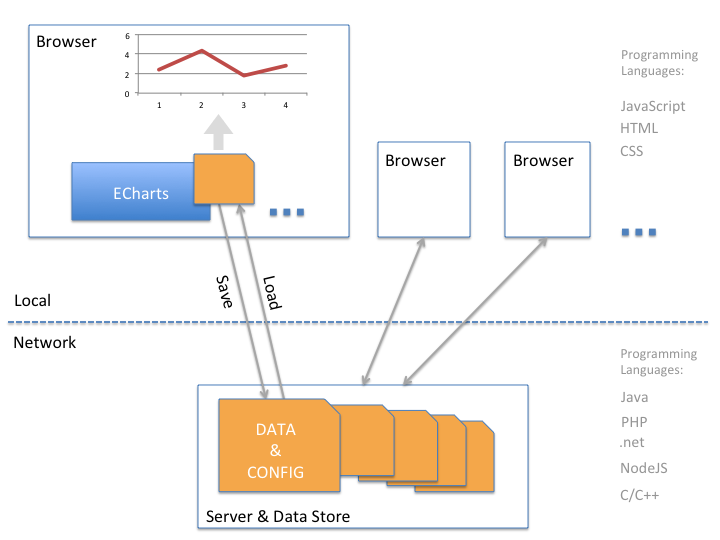

# 图表制作的一些信息
## &
# ECharts DIY

(by: echarts 团队)


---


> 本文档 URL

<http://echarts.baidu.com/share/20160906/lecture.html>

> 纲要

+ ECharts 概述
+ 图表制作工具
+ 效果示例
+ 基础知识
+ 动手制作
+ 练习和 QA

---


# ECharts 概述

----

官网 和 示例：
> + <http://echarts.baidu.com>
> + <http://gallery.echartsjs.com>

随意两个例子：
> + <http://gallery.echartsjs.com/editor.html?c=heatmap-cartesian>
> + <http://gallery.echartsjs.com/editor.html?c=xSyGj62SO>


---


# 图表制作【工具】


----

### 【工具】：（不严格不全面的）工具分类

|        类别                             |                举例               |
|:--------------------------------------: | :--------------------------------:|
| Office application                        | PPT / Excel / Pages / Numbers    |
| Graphics editor                           | PhotoShop / Adobe Illustrator    |
| BI software or service                    | Power BI / Tableau / BDP         |
| Infographic / chart web editor         | plot.ly / infogr.am / 图说 / ec-gallery     |
| Statistical computing software            | SPSS / MATLAB / R (ggplot)       |
| Web lib / pacakage                        | d3 / echarts / Map service API  |


----


### 【工具】：Office application

+ 举例：PPT / Pages / Excel / Numbers

+ 软件形式：Native App

+ 使用方式：Edit

+ 发布方式：图片 / 通用格式的文档（.ppt / .xls / ...）

+ 优点：数据处理能力**强**。使用方式广为人知。

+ 缺点：**不易于**分享（web 发布，垮平台）。图表动态能力和交互能力**差**。


----


### 【工具】：Graphics editor

+ 举例：PhotoShop / Adobe Illustrator

+ 软件形式：Native App

+ 使用方式：Edit

+ 发布方式：图片

+ 优点：视觉自定义能力**强**。使用方式广为人知。

+ 缺点：图表的用户交互能力**弱**。


----


### 【工具】：BI software or service

+ 举例：Power BI / Tableau / BDP

+ 软件形式：Native App / Web App

+ 使用方式：Edit

+ 发布方式：web asset / 图片

+ 优点：数据分析能力**强**。**易于**使用动态数据。

+ 缺点：图表（或视觉）自定义能力**弱**。需要一定学习成本。

+ 其他：有些易于 web 发布，有些不易于。


----


### 【工具】：Infographic / chart / plot web editor

+ 举例：plot.ly / infogr.am / 图说 / ec-gallery

+ 软件形式：Web App

+ 使用方式：Edit / Programming

+ 发布方式：web asset / 图片

+ 优点：图表（或视觉）自定义能力**强**。**易于**分享（web 发布）。图表的用户交互能力**强**。

+ 缺点：国外的很多在墙内不易访问，或者很慢。不少要收费。

+ 其他：数据分析能力一般或弱。多数简单易上手。少数需要一些学习成本。


----


### 【工具】：参考资源

Infographic / chart editor / BI

国内的：
> + <http://gallery.echartsjs.com>
> + <http://tushuo.baidu.com>
> + <http://h5.baidu.com/>
> + <https://www.bdp.cn>
> + <http://wentu.io/>
> + <http://www.eqxiu.com/>
> + <http://xiumi.us/#/>


----


### 【工具】：参考资源

Infographic / chart web editor / BI

国外的：
> + <https://plot.ly/javascript/> <https://plot.ly/alpha/workspace/>
> + <https://infogr.am>
> + <http://datamatic.co/>
> + <https://www.silk.co/product>
> + <http://piktochart.com/>
> + <https://datahero.com>
> + <http://chartio.com/>
> + <http://www.birst.com/>

----


### 【工具】：Statistical computing software

+ 举例：SPSS / MATLAB / R (ggplot)

+ 软件形式：Native App

+ 使用方式：Programming

+ 发布方式：图片

+ 优点：数据分析能力**极强**。

+ 缺点：学习成本**高**（编程）。


----


### 【工具】：Web lib / pacakage / API

+ 举例：d3 / echarts / Map service API

+ 软件形式：Web Library

+ 使用方式：Programming

+ 发布方式：Web asset / 图片

+ 优点：图表（或视觉）自定义能力**极强**、图表的用户交互能力**极强**、**易于** web 发布（但需要有自己的基础设施（网站等））。

+ 缺点：学习成本**高**（编程）。需要有自己的基础设施（网站等）。


----


### 【工具】：参考资源

Chart libraries (for web):

> + <http://echarts.baidu.com>
> + <https://d3js.org/>

一些国内地图服务 / API

> + <http://lbsyun.baidu.com/>
> + <http://lbs.amap.com/>
> + <http://www.dituhui.com/>


----


### 【工具】：参考资源

一些世界地图服务 / API / lib / datasource

> + <http://leafletjs.com/>
> + <https://developers.google.com/maps>
> + <http://geojson.io/>
> + <https://carto.com/>
> + <https://www.mapbox.com/>
> + <https://www.openstreetmap.org/>
> + <https://www.nasa.gov/>
> + <http://geohey.com>
> + <http://giscollective.org/>
> + <http://nanocubes.net/>
> + <http://www.naturalearthdata.com/>
> + <http://www.gadm.org/>
> + <https://github.com/wandergis/coordtransform>


----

### 总结

+ 视觉效果以及图表的定制能力：Graphic editor, Web lib
+ 用户交互能力：Web lib
+ web发布分享能力：Chart web editor, BI, Web lib
+ 数据分析能力：BI
+ 易用性和学习成本：Chart web editor

> Chart web editor + Web lib

---


# ECharts 例子

{0|<a target="_blank" href="http://gallery.echartsjs.com">gallery.echartsjs.com</a>}

----

> + {1|<a target="_blank" href="http://gallery.echartsjs.com/preview.html?c=area-rainfall&v=1">line</a>}
> + {2|<a target="_blank" href="http://gallery.echartsjs.com/preview.html?c=xHyg33VCl&v=1">bar</a>}
> + {3|<a target="_blank" href="http://gallery.echartsjs.com/preview.html?c=pie-pattern&v=1">pie</a>}
> + {4|<a target="_blank" href="http://gallery.echartsjs.com/preview.html?c=scatter-painter-choice&v=1">scatter (cartesian)</a>}
> + {5|<a target="_blank" href="http://gallery.echartsjs.com/preview.html?c=effectScatter-map&v=1">scatter (geo)</a>}
> + {6|<a target="_blank" href="http://gallery.echartsjs.com/preview.html?c=heatmap-cartesian&v=1">heatmap (cartesian)</a>}
> + {7|<a target="_blank" href="http://gallery.echartsjs.com/editor.html?c=heatmap-map">heatmap (geo)</a>}
> + {8|<a target="_blank" href="http://gallery.echartsjs.com/preview.html?c=graph&v=1">graph</a>}
> + {9|<a target="_blank" href="http://gallery.echartsjs.com/preview.html?c=xrkfsZneG&v=6">animation</a>}

----

{1|<a target="_blank" href="http://gallery.echartsjs.com/preview.html?c=xSyGj62SO">时间</a>}
{2|<a target="_blank" href="http://gallery.echartsjs.com/preview.html?c=scatter-map-brush">框选</a>}
{3|<a target="_blank" href="http://gallery.echartsjs.com/preview.html?c=map-lines-elevation">旅行</a>}
{4|<a target="_blank" href="http://gallery.echartsjs.com/preview.html?c=xSJNibj-f">记录</a>}
{5|<a target="_blank" href="http://gallery.echartsjs.com/preview.html?c=bmap-bus">公交</a>}
{6|<a target="_blank" href="http://gallery.echartsjs.com/preview.html?c=map-parallel-prices">高维</a>}
{7|<a target="_blank" href="http://gallery.echartsjs.com/preview.html?c=xBJYz2XJz">弹琴</a>}


----

{0|创作 · 分享}
<br>
{1|数据可视化中的交互}

----

#### 额外

{1|<a target="_blank" href="http://echarts.baidu.com/echarts2/x/doc/example/map3d.html">map 3d (area)</a>}
{1|<a target="_blank" href="http://echarts.baidu.com/echarts2/x/doc/example/map3d_population3.html">map 3d (bar)</a>}
{1|<a target="_blank" href="http://echarts.baidu.com/echarts2/x/doc/example/map3d_flights.html">map 3d (line)</a>}

---


# 基础知识

----

### Web chart editor



----

#### JavaScript：简单的浏览器端程序语言

```javascript
function initialChart(chart) {
    var option = {
        xAxis: {
            type: 'category',
            data: ['A', 'B', 'C', 'D']
        },
        yAxis: {
            type: 'value'
        },
        series: [{
            type: 'line',
            data: [12, 33, 55, 14]
        }]
    };
    if (chart != null)
        chart.setOption(option);
    }
}
```

----

#### JSON：数据传输格式

```javascript
{
    "xAxis": {
        "type": "category",
        "data": ["A", "B", "C", "D"]
    },
    "yAxis": {
        "type": "value"
    },
    "series": [
        {
            "type": "line",
            "data": [12, 33, 55, 14]
        },
        {
            "type": "bar",
            "data": [55, 21, 19, 38]
        }
    ]
}
```

----

<a target="_blank" href="http://echarts.baidu.com/tutorial.html#5%20%E5%88%86%E9%92%9F%E4%B8%8A%E6%89%8B%20ECharts">『五分钟上手 ECharts』</a>

---


# 动手制作


----

### 工具和资源

> + 官网：<a target="_blank" href="http://echarts.baidu.com">echarts.baidu.com</a>
> + Gallery：<a target="_blank" href="http://gallery.echartsjs.com">gallery.echartsjs.com</a>
> + 配置项查询手册：<a target="_blank" href="http://echarts.baidu.com/option.html">echarts.baidu.com/option.html</a>
> + 教程：<a target="_blank" href="http://echarts.baidu.com/tutorial.html">echarts.baidu.com/tutorial.html</a>
> + API 手册：<a target="_blank" href="http://echarts.baidu.com/api.html">echarts.baidu.com/api.html</a>
> + 表格工具：<a target="_blank" href="http://echarts.baidu.com/spreadsheet.html">echarts.baidu.com/spreadsheet.html</a>
> + <a target="_blank" href="https://developer.mozilla.org/en-US/docs/Web/JavaScript/Reference/Global_Objects/Array">JavaScript Array 方法速查手册 (1)</a>
> + <a target="_blank" href="http://www.w3school.com.cn/jsref/jsref_obj_array.asp">JavaScript Array 方法速查手册 (2)</a>


----

### 示例一

热身
> + {1|<a target="_blank" href="resource/gdp_world.xls">一份各国 GDP 数据（点击下载，excel 打开）</a>}
> + {2|根据<a target="_blank" href="http://gallery.echartsjs.com/editor.html?c=treemap-drill-down">这个例子</a>修改}
> + {3|查查文档中<a target="_blank" href="http://echarts.baidu.com/option.html#series-treemap.data"> treemap 数据格式</a>}
> + {4|使用<a target="_blank" href="http://echarts.baidu.com/spreadsheet.html">表格工具处理</a>}
> + {5|<a target="_blank" href="http://gallery.echartsjs.com/editor.html?c=xHJvImelK">结果样例</a>}

{6|再尝试}

> + {7|由<a target="_blank" href="http://gallery.echartsjs.com/editor.html?c=xS1f7Hkwf">这个地图例子</a>改}
> + {8|查查文档中<a target="_blank" href="http://echarts.baidu.com/option.html#series-map.data"> map 数据格式</a>}

----

### 示例二：

> + {1|<a target="_blank" href="resource/patent_by_year.xls">一份各年专利申请量数据（点击下载，excel 打开）</a>}
> + {2|根据<a target="_blank" href="http://gallery.echartsjs.com/editor.html?c=xrkfsZneG">这个例子</a>修改}
> + {3|<a target="_blank" href="http://gallery.echartsjs.com/editor.html?c=xByFRtxeK">结果样例</a>}

----

### 示例三：

> + {1|<a target="_blank" href="resource/patent_world.xls">一份各国家专利申请量数据（点击下载，excel 打开）</a>}
> + {2|根据<a target="_blank" href="http://gallery.echartsjs.com/editor.html?c=xSyGj62SO">这个例子</a>修改}
> + {3|查查文档中<a target="_blank" href="http://echarts.baidu.com/option.html#series-scatter.data"> scatter 数据格式</a>}
> + {4|<a target="_blank" href="http://gallery.echartsjs.com/editor.html?c=xr16-Eukt">结果样例</a>}


----

#### 练习 A：

> 做出上述三个示例。

#### 练习 B：

> 下面给出了一份数据，尝试做出一个图。
> + <a target="_blank" href="http://echarts.baidu.com/meeting/wuda/handon/medal.xlsx">各国历史金牌数据</a>
> + <a target="_blank" href="http://gallery.echartsjs.com/editor.html?c=xByDhpFIu">一个例子</a>

---


### THE END
