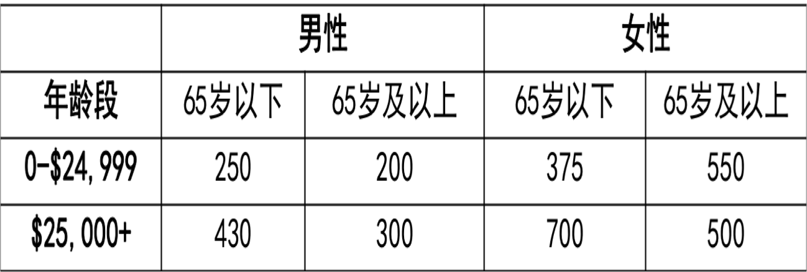
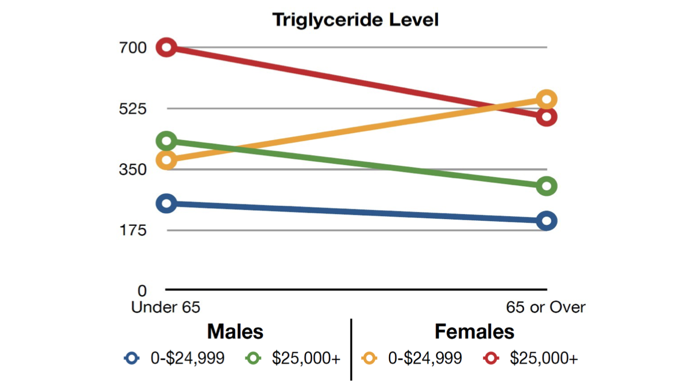
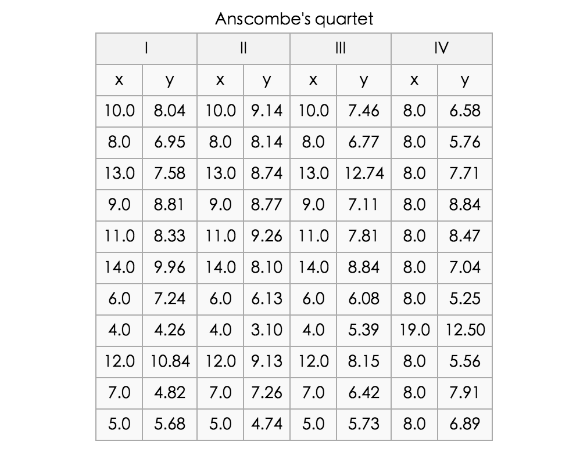
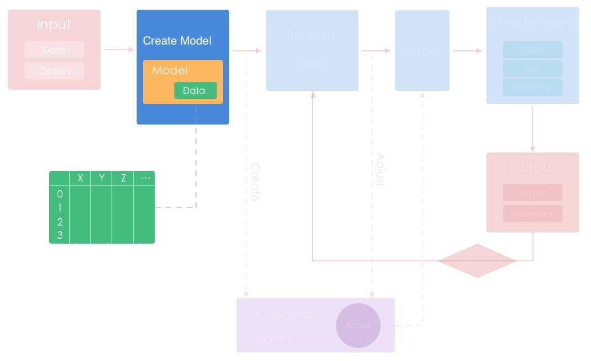
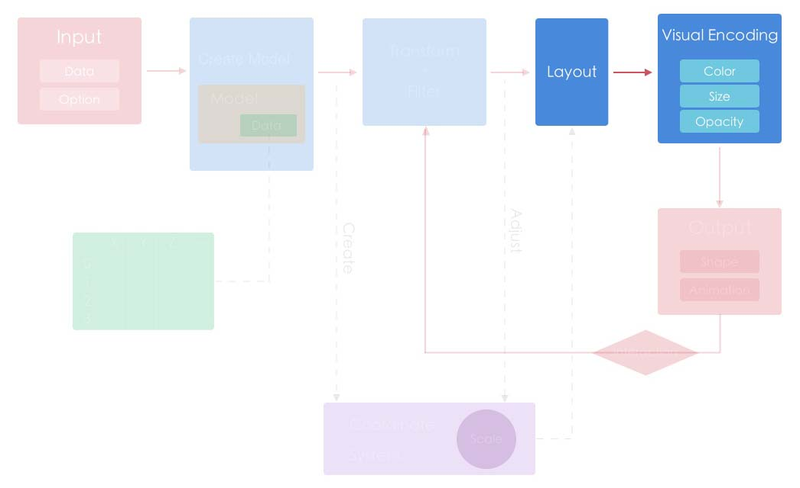
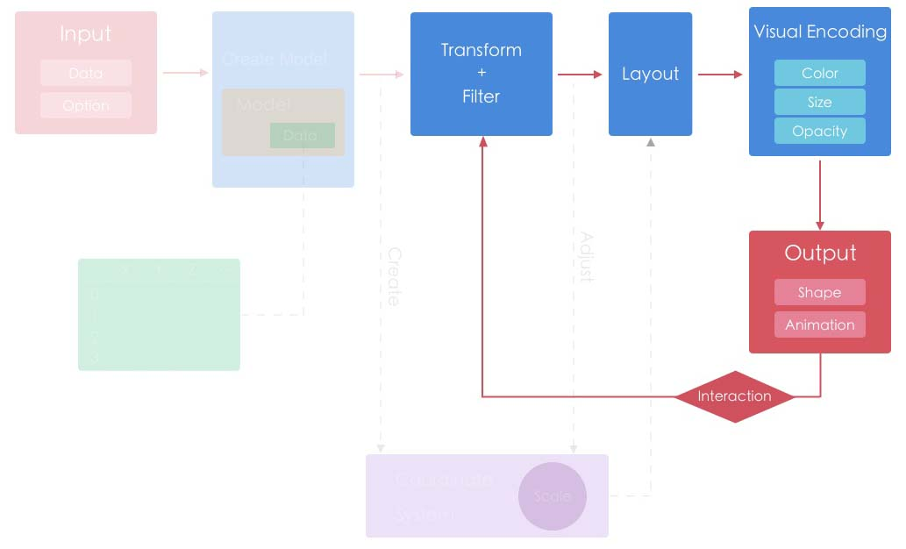

<!--
动画让可视化更有意思，编辑器修改例子，琴谱图
冰桶挑战树图，图谱？

themeRiver
桑基图？
字符云？
brushLink 的交互？
-->

# Echarts Next

### —— 数据 · 视觉编码 · 交互

Echarts团队

Note:
自我介绍

这次分享会比较科普和基础，会以展示各种示例为主

---


----


Note:
前注意视觉，视觉突出

----



Note:
这组数据是是不同年龄段不同性别的三酸甘油脂水平
哪个年龄段及收入水平人群的三酸甘油脂水平（身体脂肪量）趋势与其他均不同？

----



----


### {0|视觉感知}

> {0|客观事物通过人的视觉在人脑中形成的直接反映}

### {1|认知}

> {1|信息的获取、分析、归纳、解码、储存、概念形成、提取和使用}

Note:

在可视化与可视分析中，用户是所有行为的主题，通过视觉感知器官获取可视信息，编码并形成认知。感知和认知能力直接影响着用户获取信息的效率

从刚才两个例子中可以看到，人类对于数字，文本等形式存在的非形象化信息的直接感知能力远远落后于对于形象化符号视觉的理解

----

### {0|数据}{1|**难以感知**}
### {2|图形符号}{3|**易感知**}

Note:

可视化就是将不可见或者难以感知的数据转化为可以感知的图形，符号，颜色，纹理等

----



Note:

再举个例子，相关系数。
安斯库姆四重奏（Anscombe's quartet）是四组基本的统计特性一致的数据，但由它们绘制出的图则截然不同。每一组数据都包括了11个(x,y)点，
四组数据里 x**均值方差**全相等，y**均值方差**基本相等，x与y的**相关系数**也很接近。导致的结果是，四组数据**线性回归**的结果基本一样。
但是，这四组数据**本身差别很大**。
分析数据前先绘制图表的重要性

----

{1|~[800*500](./asset/ec-demo/anscombe-quartet.html)}

Note:
这几个暖场例子都是为了说明可视化的意义，然后进入这次分享的主要部分

---

# Echarts Next

### —— 数据 · 视觉编码 · 交互

---

### ECharts 简介

ECharts 是一个开源的前端可视化库，提供了

+ 声明式的编程接口

+ 丰富的可视化类型和交互方式

+ 大数据量展现的能力

+ 吸引眼球的动画和特效

Note:
ECharts 是一个开源的前端可视化库，首先他是一个前端的js库，所以使用的时候需要一点点前端基础，尽管也还是有很多不写程序的会在我们的示例平台上改改数据就把拿截图用，这是我们之前没想到的一种 echarts 的使用方式。

提供了声明式的接口

只需要指定你要展现的数据，展现的类型，后续更新也只要给出新的数据，把其它的都交给 echarts 来做。

提供了包括基础的折柱饼散点气泡，还有复杂的treemap, graph, 桑基图，平行坐标等

我们经常会拿一个 ThinkingGIS 使用 echarts 做的有 13w 点的微博签到图的来做例子

----

### 当前情况

+ GitHub 关注数 ~12k

+ 月均下载 ~50k

+ 官网访问量 ~200k pv


Note:
很多公司或者组织在用 echarts 做报表，可视化展现，例如国家统计局

或者像数据观，文图，数说立方等在线可视化或者BI平台

markEditor

也会经常看到某个网站中使用的图表配色和样式好熟悉

----

### Echarts Next

##### v3.1.10

<div class="left" style='float:left;width:48%'>
    <ul>
        <li><p>模块化</p></li>
        <li><p>移动端</p></li>
        <li><p>扩展性</p></li>
    </ul>
</div>

<div class="right" style='float:left;width:48%'>
    
</div>

Note:
从去年 8 月份起我们开始着手计划 echarts 3.0 的开发，目的是解决 2 里面一直头疼的几个问题，模块化，移动端和扩展性，像很多项目一样，我们把它叫做 ECharts Next，我们希望能够基于它的扩展性做更多的事

<!-- {0|} -->

----

### 流程和模块划分


Note:

组件的扩展可以做到嵌入到其中某个块，比如百度地图扩展，在 2 中每次拖动刷新都需要重新 setOption，但是在 3 中只需要嵌入新的坐标系统，其它能够在地图上展现的图表就可以直接使用这个扩展的百度地图坐标系。

还有图的布局，在 2 中就是写死了只能使用力引导，但是 3 中可以在布局阶段中注册新的布局方法，从而引入其它的布局方式，比如树形的布局，或者使用新的改良的力引导算法

dagre.js


接下来主要就是对里面的数据，视觉编码和交互部分做介绍，这三点是数据可视化里非常重要的概念，也是我们设计和开发 echarts 时着重考虑的几点。

---

##数据 · 视觉编码 · 交互

----

# 数据

Note:
首先是数据，数据在我们这张图中的最上流

----



Note:
因为 echarts 对于输入的要求相对还是比较宽泛的，有可能碰到各种各样的输入数据，所以需要预处理 normalize 一下，然后归类，统一存储到这个 data 结构里

----

### 类别

* {0|数值}

    * {0|10米 5mA 2048KB 312天}

* {1|有序}

    * {1|小，中，大}
    * {1|周一，周二，周三}

* {2|类别}

    * {2|北京，南京，开封}

* {3|维度}

    * {3|一维、二维、三维、n维}

* {4|关系}

    * {4|树、图（网络）}


Note:
首先给数据输入的数据归类

数值型数据: 18厘米，1米8，180平米，可以求和，求平均值，求方差等统计属性

有序数据：不连续，不能进行数值计算，可以比较大小

然后是类别：它是无序的

可视化的设计、ec的制作中，考虑对数据从这些类别上来刻画。
映射、视觉元素

之所以要分类是因为在视觉编码或者数据处理的过程中需要区别对待


然后划分维度，如果是关系数据还会需要额外的结构去组织这些关系。

----

### 数据操作

+ 过滤筛选

+ 统计

    + 平均值，最大值，最小值，求和，线性回归

---

# 可视编码

----



----

* {0|标记（图形元素）}
* {1|视觉通道}

Note:

可视编码由两部分组成:标记 和 视觉通道（用于控制标记的视觉特征）

可视编码是信息可视化的核心，合理的可视编码选择直接影响了可视化的结构是否清晰，易于理解，美观。

----

## 标记

<div style="min-width: 1050px">
<div style="float:left;">
{0|
点
~[350*400](./asset/ec-demo/glyph-point.html)
}
</div>

<div style="float:left;">
{1|
线
~[350*400](./asset/ec-demo/glyph-line.html)
}
</div>

<div style="float:left;">
{2|
面
~[350*400](./asset/ec-demo/glyph-area.html)
}
</div>

Note:
点拥有颜色，形状，位置等属性
线用于连接点，可以表示数据的方向或者走向，形状
面可以通过面积表示数据的范围，大小

----

## 视觉通道

+ {0|颜色}
    {1|亮度、饱和度、透明度、色调}
+ {2|尺寸}
+ {3|形状}
+ {4|纹理}
+ {5|方向}
+ {6|动画}


Note:
视觉通道不仅具有分类性质，也具有定量属性

生物学上，视觉通道指的是“大脑接受外部世界视觉信息的通道”，是“通过眼睛接受外界光线的明暗、色彩、形状等，产生对事物的辨别与记忆能力”

但是在可视化中，可能没有给予足够的意识

1.类型（type）
    是什么/在哪里（what/where）
    何种程度（how much）

其中视觉通道要求：
2.表现力（expressiveness）
    要求通过准确编码，来表达数据的完整属性
    判断标准：精确性、可辨性、可分离性、视觉突出
3.有效性（effectiveness）
    通道表现力符合数据属性的重要性

一个好的动画除了让人感到情怀之外还能够突出数据，或者表达两组数据的联系，或者表达同一组数据在不同时间下的联系，不会让人觉得数据的变换太突兀

下面是通过一些例子去解释这些视觉通道

----

### 颜色


{0|类别型数据}

{1|~[800*500](./asset/ec-demo/color-category.html)}

Note:
首先是最常用的颜色

颜色通常会用来区分不同类别的数据，比如这个饼图的不同数据就会显示不同的颜色。
可以看到在鼠标移到某个扇形或者选中这个扇形时会通过动画和高亮对这个数据进行视觉突出。

----


#### 颜色 - 类别型数据

{0|~[900*600](./asset/ec-demo/color-category-scatter.html)}

Note:
还有很常见的是把同一组数据都编码成相同的颜色，不同组的数据颜色都会不一样，比如这个用散点图表示男女身高体重的例子里将男女两组数据分别编码成红色和蓝色。

人们在观察事物的时候，会自然地根据事物的相似性进行感知分组。

颜色的挑选除了能够让作品更加美观，还能清晰的区分不同组的数据，不会让人迷惑。

同样的，我们在移动到这个图例上时，会对关注的数据做一个高亮的视觉突出，让大家能够注意到这组数据

----


#### 颜色的亮度 - 数值型数据

{0|~[900*600](./asset/ec-demo/color-grey.html)}

Note:
尽管颜色主要用来区分类别型数据，但是颜色的亮度可以用来表示数值型数据的大小

比如这个例子

----

{0|~[900*600](./asset/ec-demo/map-alcohol.html)}


Note:
再比如这个例子，数据是 WHO 公布的全球各个国家的人均酒精消耗量，也是通过颜色的明暗度表现数据的大小，数据越大的颜色越深。

（说实话我个人看到这个数据的时候还是挺震惊的

----

#### 颜色 - 数值型数据

{0|~[900*600](./asset/ec-demo/heatmap-cartesian.html)}

Note:

有时候也会不用明暗度，而是用不同色调的颜色来编码数值型数据，常见的例子就是热力图。中间的值会插值 RGB 得到。

仅仅是使用颜色明暗度编码对于人类视觉来说可能会不够敏感，所以很多时候也会根据大家习惯的规则把数据映射成区分度更大的不同颜色，比如数据小的映射到蓝色，数据大的映射到红色，就成了大家可能经常见到的热力图。

这个例子是某一天我在 GITHUB 上统计的 echarts 在不同时间段的 commit 记录，可以看到最频繁的就都中在周中的下午。

----

#### 大小 - 气泡图

~[1200*600](./asset/ec-demo/map-bubble.html)

Note:
然后大小，也就是尺寸，比较常见的用大小来编码数据的是气泡图，通过圆的半径来表示数据的大小，比如这个全球人口数量的例子，每个国家的人口数量会映射到气泡大小上。

----

#### 多种视觉通道

<div style="text-align: center; width: 1110px;">

<div style="display:inline-block;vertical-align:middle;width: 300px">

更多的维度<br>


</div>


<div style="display:inline-block;vertical-align:middle;width: 800px">


{0|~[1000*500](./asset/ec-demo/color-mix-aqi.html)}

</div>
</div>

+ {1|控制一个图里视觉通道的数量}

Note:
对于高维度的数据，我们可以在同一张图上把不同维度的数据映射到不同的视觉通道上，比如这个是空气质量的例子，

横轴是日期，纵轴是 AQI 指数

圆的面积表示 PM2.5的浓度，颜色明暗表示SO2的浓度。
通过调整数据选择器，可以直观反应一些问题。

这组数据可以被映射到亮度(Lightness)、饱和度(Saturation)、透明度(Alpha)、形状(symbol)、大小(symbolSize)

我们可以移到图形上看到数据各个维度分别对应在视觉通道中的位置，通过交互可以筛选突出我们需要的那部分数据


当然还是不建议在一个图中编码太多的视觉通道，很容易会让整个图显得杂乱无章，实验里有个词叫控制变量，可视化也是，太多的变量会让人无从对数据进行对比

----


### 形状

~[1000*500](./asset/ec-demo/symbol.html)

Note:
然后是不那么常用的形状，形状就常用来编码类别型数据。常用的有三角，矩形，圆等

----


### 形状

~[1000*500](./asset/ec-demo/symbol-categories.html)

Note:

再拿刚才那个空气质量指数的例子举例，数据里面最后维度空气质量的高，中，低是有序数据，我们就可以把这个维度用形状来编码。


----


~[1000*500](./asset/ec-demo/category-symbol.html)

+ {0|形状的区分度并不如颜色}

Note:
虽然可以把不同类别的数据映射到形状上，但是效果并不如颜色和大小，大家要发现万花丛中一点红比较容易，但是如果要发现一朵不一样的菊花就比较难。

所以把重要的信息映射到人感知比较敏感的视觉通道上。

----

## 动画

* {0|带来工程的复杂性}

    * {0|软件脆弱}
    * {0|代码繁杂}

* {1|表达 数据/图形元素在**变化**中的**联系**，助于理解}

Note:

对于一个图形库来说，动画带来的工程复杂度比其它几个视觉通道是要大得多的。

（1）虽然动画带来工程角度的复杂性，使代码更难维护和抽象，增加软件的脆弱（带来bug），增加代码的繁杂（性能优化）。
（2）但是表达交互中数据/图形元素变化的联系，比突变的数据展现更助于理解，让展示的过程不那么生硬

因为我们觉得动画在可视化交互中有比较好的效果，是很重要的一点，因此在动画绘制方面花了一些大的精力去处理。增加了更好的视觉实现。

----

### 视觉突出

~[1200*600](./asset/ec-demo/map-aqi.html)

Note:
Bling Bling

<!--
这个不讲了

### 色彩设计原则

* 避免过多颜色交错导致的杂乱无章
* 使用中性背景色，控制对全局色彩的影响
* 最小化同时对比
-->

----

### 视觉引导数据的变化

~[1200*600](./asset/ec-demo/wealth-health.html)


Note:

这是在 Gapminder 上一个经典的数据可视化分析例子，将世界各国的各种数据通过气泡图来展现，并且增加了动画效果，便于观察某项数据的变化情况。
横坐标=>人均收入，纵坐标=>人均寿命，气泡颜色=>国家，气泡的大小=>总人口。

原始数据的国家比较多，保留了主要国家演示。

结论：
经过二战以后，各国都快速发展，中国在61-62年期间数据大幅下降——三年灾害
二战后美国迅速崛起、改革开放以后，中国迅速发展、但欧美远超亚洲、挪威遥遥领先、朝鲜垫底

<!-- 修改各个维度的数据，就可以呈现多种结论。非常有意思 -->


----

### 线数据的方向

~[1200*600](./asset/ec-demo/migration2.html)


Note:
动画也能非常形象的用来表示线数据的方向

这里用飞机的图标来作为形状也是一种可视化隐喻的方式。

---

### 交互


----


Note:
TODO: 一个交互的例子
为什么要交互，有的可视化是为了单纯的展现，这些图会很简单清晰，但是有些可视化是为了让人能够探索，就像地图一样，有时候一个图出来肯能看起来很繁杂，信息量很大，大家都会觉得可视化应该是让数据变得更易读而不是很复杂，这时候我们就可以通过交互提取或者高亮出里面我们需要的部分。

----



Note:
用户通过鼠标操作，比如点击，拖拽，会触发动作，修改其中组件的配置项，然后数据重新进入流程，但是因为配置项的改变，所以其中的编码规则，数据规则都会发生相应的改变，所以用户可以通过交互看到不同的可视化效果，进而从不同的角度去解读数据

----

### 可视化交互原则

+ {0|总览为先（Overview first）}

+ {1|缩放过滤（Zoom and filter）}

+ {2|按需查看细节（Details on demand）}

Note:
可视化交互过程中，一般有一下这些操作：总览、缩放、过滤、查看细节等

----

#### 数据缩放 - 单一维度选择

~[1000*500](./asset/ec-demo/dataZoom-K-line.html)

Note:
现实中比较常见的就是股市的 K 线图，或者网站流量等时序数据，这个是 2015 年上证指数的 K 线图，我个人不玩股票，但是还是能听说去年股市的惊心动魄，这个图里就可以看到整一年的股市走向，先红再绿，如果我们要看具体一个时间段每天是红还是绿，就可以选择缩放到这个区域。

----

#### 数据缩放 - 多维度选择

~[1000*500](./asset/ec-demo/dataZoom-cartesian-hv.html)

Note:
这是一个有3000多条数据的柱状图，我们可以缩放横轴时间轴查看具体时间段的数据，也可以缩放纵轴看某个数值区间的变化

----

#### Treemap

~[1400*650](./asset/ec-demo/hierarchy-obama.html)

Note:
这个是在 treemap 应用交互的例子，treemap 在国外特别流行，用来可视化层级数据，这个例子是奥巴马政府在 2011 年和 2012 年的各部门财政预算分配，分为几大块，通过面积编码支出的多少。我们可以概览看到财政支出最大的一块是医疗，如果好奇其中更细的分配，可以通过缩放查看其中的细节。

切换不同年份我们可以通过动画看到财政预算在 2011年和 2012 年的变化

我们也可以通过这些按钮调整 treemap 的视觉编码，例如通过明暗度显示 2012 年和 2011 年相比的增长率

----

#### 下钻 - Map

~[1400*580](http://localhost/starbucks)

Note:
这是一个用 echarts 的地图组件做的全球 2w 多家星巴克店分布的例子，刚进去的时候能够概览每个国家拥有的店数量，可以点击国家，下钻查看需要的国家中星巴克的分布情况。

----

#### 下钻 - Treemap

~[1400*580](./asset/ec-demo/treemap-drilldown.html)

Note:
刚才的 treemap 也可以利用下钻的交互，这组数据是 echarts 的配置项文档在 4 月份的查询统计，配置项是树形结构的，所以很自然的也可以使用 treemap 做可视化，这里可以看到

---

# 不同数据的可视化例子


Note:
以上数据可视化过程中的基本概念就介绍结束了。接下来看下实际可视化场景中的例子。

----

### GIS 数据的可视化 - 点数据


{0|~[1000*500](./asset/ec-demo/map-weibo.html)}

Note:
点数据，地理数据上的点数据就是所谓的 POI，


描述地理空间中离散的点，具有经度和纬度的坐标，但不具备大小和尺寸，
包括地图上的地标、附件的美食等

最直接的可视化点数据的方法
根据坐标直接标识在地图上，圆点是最常用的标识符号，其他标识符号还有向量箭头


weibo签到：13w 数据

----

### GIS 数据的可视化 - 线数据
{0|~[1200*600](./asset/ec-demo/map-lines.html)}

Note:

在地理数据中，线数据通常是指连接两个或者更多地点的线段和路径，常用来表示路线的轨迹

毅行

这个例子是我在 wikiloc 上找的一组环湖毅行的 GPS 数据，

----

### GIS 数据的可视化 - 热力图

{0|~[1200*600](./asset/ec-demo/map-heatmap.html)}

Note:

还有一种常见的可视化地理点数据的方式是热力图。

从 http://www.wikiloc.com/ 上搜集的几十条徒步和登山路线，把 GPS 轨迹都通过打点的形式累加的画在地图上，然后映射成热力图的形式，通过热力图我们可以非常直观的聚焦到热点地区，但是它只是个概览，不能查看具体一个区域或者一条路线的细节。

同样我们可以看到，类似的数据我们可以用不同的方式去可视化展现，从而可以从不同角度去解读这份数据。

----


### 时间数据的可视化


{0|~[1000*500](./asset/ec-demo/star-history.html)}

Note:
时间数据最常见的就是把它作为一个横轴，然后纵轴是每个时间点的数据大小。

横轴为时间的时序数据最适合使用折线图去表达，因为能够表现出数据变化的一个趋势

----

### 动态时间轴


~[1000*500](./asset/ec-demo/timeline-ecnomic.html)

Note:
但是如果数据有更多的维度，比如横轴要用来表示其它的信息，
我们也可以把时间作为更高层的一个维度。这个全国各省 GDP 的例子，我们就可以使用一个时间轴通过动画去展示每一年的变化，包括各省的增长，第一产业，第二产业第三产业每年占比的变化等等。

----

### 动态时间轴

~[1200*600](./asset/ec-demo/wealth-health-timeline.html)

Note:
还有之前演示过的

----

### 时间数据的轨迹表示

~[1200*600](./asset/ec-demo/wealth-health-graph.html)

Note:
如果我们把刚才图中运动的轨迹都投影到一张图上，通过在前后两年添加一条关系变来表达整个经济和人均寿命的走势，可以一眼清楚的看到这个国家在哪些时间人均寿命和经济的变化比较大，哪些时间比较稳定

这块地区比较密集看不清楚走势，我们试一下通过缩放组件放大到这块区域


这个图实际上是把 echarts 中的 graph 放在了笛卡尔坐标系上，


----

### 多维度

```
[
    [1,55,9,56,0.46,18,6,"良"],
    [2,25,11,21,0.65,34,9,"优"],
    [3,56,7,63,0.3,14,5,"良"],
    [4,33,7,29,0.33,16,6,"优"],
    [5,42,24,44,0.76,40,16,"优"],
    [6,82,58,90,1.77,68,33,"良"],
    [7,74,49,77,1.46,48,27,"良"],
    [22,84,94,140,2.238,68,18,"良"],
    [23,93,77,104,1.165,53,7,"良"],
    [24,99,130,227,3.97,55,15,"良"],
    [25,146,84,139,1.094,40,17,"轻度污染"],
    [26,113,108,137,1.481,48,15,"轻度污染"],
    [27,81,48,62,1.619,26,3,"良"],
    ...
]
```

----

~[1000*500](./asset/ec-demo/color-mix-aqi.html)

Note:

这个示例之前有演示过
在二维/三维图表上增加视觉通道，以表达更多的属性信息。
但是刚才提过过多的信息通道会让人无从对比数据。

----

### 高维数据 - 平行坐标轴

{0|~[1100*600](./asset/ec-demo/parallel-aqi.html)}

Note:

平行坐标用于表现高纬度的数据，他克服了传统笛卡尔坐标系（直角坐标）下对空间占用的消耗，难以表达三维以上的数据，
可以在一个平面上显示更多维度的数据。
这里是空气质量在不同时间下，不同数据的表现。

----

### Progressive Rendering

{0|~[1100*600](./asset/ec-demo/parallel-nutrients.html)}

----

### 高维数据 - 散点矩阵

{0|~[1100*600](./asset/ec-demo/scatter-matrix.html)}

Note:
散点矩阵能够在一个视图难展现多个变量之间的两两关系，找出其中的相关性

----

### 关系数据

+ {0|树}

+ {1|图}

Note:
会有额外的信息表达数据的关系


----

#### 层级数据的可视化 - Treemap

~[1400*580](./asset/ec-demo/hierarchy-disk.html)

Note:
国外比较流行的

----

#### 层级数据的可视化 - Sunburst

~[1400*580](./asset/ec-demo/pie-sunburst.html)

Note:
国外比较流行的


----

#### 网络数据的可视化（图）


{0|~[1400*600](./asset/ec-demo/graph-layout.html)}

Note:
网络数据
可以表示点和关系的信息，可视化中用的比较多，比如社交网络中人物的关系图是非常常见的 case。

这个例子是悲惨世界中的人物关系图，可以很清晰的看到数据的关系和权重
graph 多种 layout。


----

#### 力引导 force-directed

{0|~[1400*600](./asset/ec-demo/force.html)}


Note:
力引导是目前非常常见的无向图的布局算法，刚才那张图就是通过力引导算法离线布局生成位置的。

每个点都拥有引力和斥力，相近相斥，离远相吸。经过多次的布局迭代，就可以达到一个稳定的布局结构。

一般算法每次迭代都是 O(n2) 的时间复杂度，也可以通过四叉树优化到 O(nlogn) 的事件复杂度，但是因为要多次迭代，所以如果不用动画表现出来，很容易浏览器就会假死在那。


---

## 总结

+ 视觉编码
    + 区分，比较，美观

+ 视觉突出
    + 突出关注的数据

+ 交互
    + 总览为先，按需查看细节

Note: 这次分享强调的最多的可能还是视觉编码，视觉突出和交互，这几块一直是可视化的核心

----

## 谢谢


